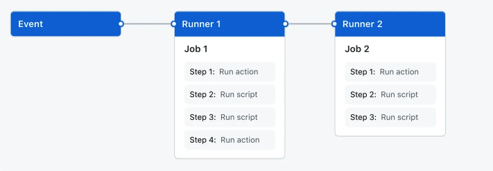
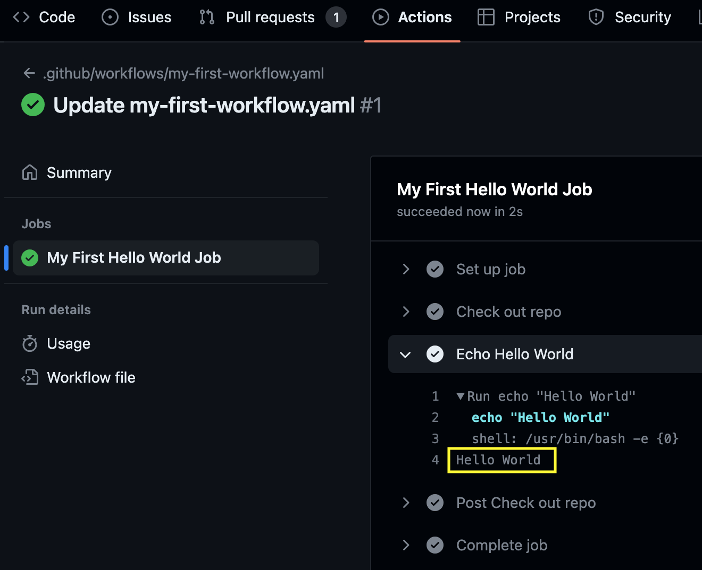

# Overview

GitHub Actions is a continuous integration and continuous delivery (CI/CD) platform that allows you to automate your build, test, and deployment pipeline. You can create workflows that build and test every pull request to your repository, or deploy merged pull requests to production.

If you really want to get to know it, go to the vendor's [site](https://docs.github.com/actions) to get all the information!

# High Level Architecture



# The components of GitHub Actions

## Workflow/s	

A workflow is a configurable automated process that will run one or more jobs. Workflows are defined by a YAML file checked in to your repository and will run when triggered by an event in your repository, or they can be triggered manually, or at a defined schedule.

Workflows are defined in the **.github/workflows** directory in the repository.

### Example

`.github/workflows/my-first-workflow.yaml`

## Event/s 

An event is a specific activity in a repository that triggers a workflow run. For example, activity can originate from GitHub when someone creates a pull request, opens an issue, or pushes a commit to a repository. 	

### Example

```
on:
  pull_request: #<-- This is the event that's going to trigger the next set of job/s. So only when there's a PR (Pull Request) is when this workflow will begin to start the job/s
```

## Job/s	

A job is a set of steps in a workflow that is executed on the same runner

### Example

```
on:
  pull_request:
jobs:
  MyFirstJob: #<-- Name of job_id
    name: My First Job #<-- Prettier Name of Job you'll see in GitHub Actions UI
  MySecondJob: #<-- Name of job_id
    name: My Second Job #<-- Prettier Name of Job you'll see in GitHub Actions UI
```

## Step/s	

Each step is either a shell script that will be executed, or an action that will be run. Steps are executed in order and are dependent on each other. Since each step is executed on the same runner, you can share data from one step to another. For example, you can have a step that builds your application followed by a step that tests the application that was built.

### Example

```
on:
  pull_request:
jobs:
  MyFirstHelloWorldJob:
    name: My First Hello World Job
    steps: #<-- This is where you can begin creating a bunch of steps to
           #do a bunch of actions
      - name: Check out repo #<-- The name of the first step in
                             #MyFirstHelloWorldJob
        uses: actions/checkout@v2 #<-- It's using GitHub's
                                  #maintained/verified repo
                                  #(https://github.com/actions/checkout,using tagged label v2)
                                  #to checkout your code (a Pull Request in this examaple)
      - name: Echo Hello World #<-- The name of the second step in
                               #MyFirstHelloWorldJob
        run: echo "Hello World" #<-- runs the Linux command echo with an input of "Hello World"
 
NOTE: in order to use echo command (Linux command) defined by run:, there is a dependency on which runner this job is running on which we'll cover next
```

## Runner/s	

A runner is a server that runs your workflows when they're triggered. Each runner can run a single job at a time. GitHub provides Ubuntu Linux, Microsoft Windows, and macOS runners to run your workflows; each workflow run executes in a fresh, newly-provisioned virtual machine.

### Example

```
on:
  pull_request:
jobs:
  MyFirstHelloWorldJob:
    name: My First Hello World Job
    runs-on: ubuntu-latest #<-- When the job runs and executes the
                           #step/s, it will run on the latest version
                           #of Ubuntu linux which allows the use of
                           #the echo command
    steps:
      - name: Check out repo
        uses: actions/checkout@v2
      - name: Echo Hello World
        run: echo "Hello World"
```

## Sample Workflow File	

Here's the sample workflow file

### Example

```
on:
  pull_request:
jobs:
  MyFirstHelloWorldJob:
    name: My First Hello World Job
    runs-on: ubuntu-latest
    steps:
      - name: Check out repo
        uses: actions/checkout@v2
      - name: Echo Hello World
        run: echo "Hello World"
```
## What it looks like in the GitHub Actions UI


